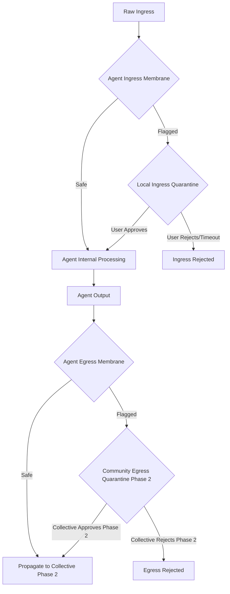

# SPARC Architectural Mapping: Craftsman Pivot

> Generated: 2026-04-19T01:18:24.982Z
> Model: gemini-2.5-flash via PAL
> AIDefence: BLOCKED (security content — expected) | RVF Witnessed: yes (2 entries)
> Goal: Craftsman Pivot — agent-first protection reframing of RuCLAW Fleet
> Note: Invariants section (S.3) requires correction — Gemini inferred I-1 through I-7 without access to actual definitions. See ruclawfleet-arch-baseline.md Section 2 for ground truth.

---

## S (SPECIFICATION)

The "Craftsman Pivot" reframes the RuCLAW Fleet project from a collective-first governance model to an agent-first protection paradigm. This document outlines the architectural implications of this strategic shift.

### New Protected Unit

The new protected unit is an **individual agent instance**. This instance is a self-contained, isolated execution environment, envisioned as a potentially WASM/Rust browser-contained entity. Each agent operates with its own localized state, distinct from other agents, and is the primary locus of security enforcement. The collective becomes a secondary, aggregated layer of protection and governance.

### Ingress Membrane Responsibilities

The ingress membrane is responsible for protecting the agent from external inputs, ensuring that "what the agent perceives" is safe, compliant, and does not compromise the agent's integrity or intended function.

Key responsibilities include:
1.  **Input Sanitization & Validation:** Filtering and validating all incoming data, prompts, and code snippets to prevent injection attacks, malformed inputs, or attempts to bypass agent logic.
2.  **Threat Detection (Pre-Perception):** Utilizing the existing 4-layer security stack (WASM corpus gate, aidefence fast-path, LLM Surgeon, coherence HNSW backstop) to identify and flag hazardous or malicious content before it reaches the agent's core processing unit.
3.  **Contextual Filtering:** Ensuring inputs align with the agent's defined operational context and persona, rejecting out-of-scope or manipulative content.
4.  **Local Quarantine & User Review:** Presenting suspicious ingress to the local user for explicit review and approval/rejection, acting as a human-in-the-loop safeguard.
5.  **Witness Chain Generation:** Initiating cryptographic witness chains for all significant ingress events, establishing a verifiable provenance record.

### Egress Membrane Responsibilities

The egress membrane is responsible for protecting both the agent and the broader collective from outputs generated by the agent, ensuring "what the agent submits" is safe, compliant, and adheres to established policies.

Key responsibilities include:
1.  **Output Validation & Policy Enforcement:** Applying `applyAdmissionPolicy` to all agent-generated outputs to ensure they meet safety, ethical, and operational guidelines. This includes checking for hazmat content, policy violations, and unintended disclosures.
2.  **Threat Mitigation (Post-Generation):** Preventing the agent from propagating malicious code, sensitive data, or harmful instructions.
3.  **GOAP Transition Validation:** Ensuring that any proposed state transition resulting from the agent's output is valid according to the agent's localized GOAP model and invariants.
4.  **Community Egress Quarantine:** Submitting flagged or high-risk egress to a collective review process (Phase 2) for broader scrutiny and consensus before propagation.
5.  **Witness Chain Extension:** Extending cryptographic witness chains to cover agent outputs and their associated validation outcomes, maintaining an unbroken record of agent activity.

### Invariants (I-1 through I-7) — Agent-Scale Applicability

> Source of truth: `docs/ruclawfleet-arch-baseline.md` Section 2.
> Corrected 2026-04-19 — Gemini GOAP output guessed generic security concepts ("data integrity", "non-repudiation"). The actual invariants are architectural forbidden-code-path rules. All 7 apply at agent scale.

| # | Invariant | Forbidden path | Applies at agent scale? | Agent-scale enforcement notes |
|---|-----------|----------------|:-:|---|
| I-1 | Classification, admission, and propagation are **separate decisions** | No function may produce a ClassificationRecord and an AdmissionRecord as a single atomic output. No function may produce a PropagationRecord as a side effect of admission. | **Yes** | The agent's egress membrane must maintain three distinct steps: classify the output, apply admission policy, then decide propagation. Collapsing them into a single "is this safe?" check violates I-1 even at agent scale. |
| I-2 | **No write to shared state** without a PropagationRecord-backed decision | No code path may write to approved lesson store, shared adaptive layer, fleet memory, or external export without first creating a PropagationRecord with an explicit `decision` field. Silent writes are forbidden. | **Yes** | At agent scale, "shared state" includes the agent's own persistent memory, learned patterns, and any egress to the community. Even local writes to `learned-patterns.json` or local knowledge graph updates are governed by this invariant. |
| I-3 | The adaptive layer is **non-authoritative** | No code in the Ru Pi / adaptive layer may create PropagationRecords, modify AdmissionRecords, or widen propagation scope. It may only emit InflectionSignals. | **Yes** | At agent scale, the sparse brain (Ru Pi) may signal that something is anomalous, but it cannot directly approve, reject, or widen scope. RuCLAW processes those signals through its own policy. This prevents the brain from self-authorizing during training. |
| I-4 | **WitnessRecords must exist** for all consequential transitions | Any of the following must produce a WitnessRecord: intake, classification, admission decision, propagation decision, write-back, revocation, supersession. Skipping witness generation is forbidden. | **Yes** | Critical at agent scale — the witness chain is what makes user review decisions auditable, enables "undo" / rollback, and provides forensic evidence if the agent is poisoned. Without it, local quarantine approvals are unaccountable. |
| I-5 | PropagationRecord **mutation is forbidden** | To narrow, widen, or revoke a propagation decision, a new PropagationRecord with a `supersedes` pointer must be created. The original record is append-only. | **Yes** | At agent scale, this prevents retroactive tampering with propagation history. If a user approves something that later turns out to be harmful, the original decision is preserved and a new superseding record is created — the audit trail is never rewritten. |
| I-6 | Hazmat classification output **does not directly authorize write-back** | A `HazmatClassificationResult` does not constitute admission or propagation authorization. It feeds an `AdmissionDecision`, which then feeds a `PropagationRecord`. | **Yes** | At agent scale, this means the egress membrane's `analyzeHazmat()` call classifies but does not approve. The result must flow through `applyAdmissionPolicy()` and then a PropagationRecord before anything leaves the agent. This is the core I-1/I-6 enforcement chain. |
| I-7 | Participant type **does not itself grant trust** | No code path may grant propagation authority, admission authority, or scope widening solely because `participant_type` matches a category. Explicit capability/role grants drive decisions; type is provenance context only. | **Yes** | At agent scale, this means a "privileged_process" or "internal_agent" label on an input does not bypass the membrane. The ingress checks apply regardless of who sent the input. This prevents trust escalation attacks where an adversary spoofs a trusted participant type. |

**Conclusion:** All 7 invariants apply at agent scale without modification. The pivot does not weaken any invariant — it narrows *where* they are enforced first (agent boundary) while deferring *collective-scale enforcement* (fleet propagation, break-glass quorum) to Phase 2. The GOAP validator's `checkTransition()` kernel enforces these at both scales identically.

### Consequential State Transition Definition

A "consequential state transition" signifies a change in the system's state that has material implications for security, policy, or operational integrity.

*   **For a single agent:** A consequential state transition is any change to the agent's internal state, its perception of reality (ingress accepted), or its external actions (egress submitted) that could:
    *   Violate an invariant (e.g., accepting a malicious input, generating a policy-violating output).
    *   Alter its operational parameters or persona.
    *   Lead to the generation of a `ClassificationRecord`, `AdmissionRecord`, or `WitnessRecord`.
    *   Trigger an `InflectionSignal`.
    *   Result in data being stored, processed, or transmitted.
    *   *Example:* An agent accepting a new instruction, classifying an artifact as hazmat, or attempting to propagate an output.

*   **For a fleet (collective):** A consequential state transition is any change to the aggregated state, shared policies, or inter-agent relationships that could:
    *   Impact the security posture or operational parameters of multiple agents.
    *   Alter collective governance rules or the `break-glass protocol` state.
    *   Modify the global `coherence HNSW backstop`.
    *   Lead to the `PropagationRecord` of an artifact across the fleet.
    *   *Example:* A collective policy update, a fleet-wide quarantine directive, or the global propagation of a new model.

## P (PSEUDOCODE)

This section outlines how existing components and pipelines adapt to the agent-first model.

### Mapping Existing 4-Layer Stack to Ingress Membrane Roles

The existing 4-layer security stack directly forms the core of the agent's ingress membrane.

```python
# Pseudocode for Agent Ingress Membrane
def agent_ingress_membrane(raw_input: RawArtifact, agent_state: AgentState) -> Optional[ProcessedArtifact]:
    """
    Processes raw input through the agent's ingress membrane.
    Returns processed artifact if safe, None if rejected or quarantined.
    """
    # 1. WASM Corpus Gate (Initial sanitization & format validation)
    if not wasm_corpus_gate.validate(raw_input):
        log_event("Ingress: WASM Corpus Gate rejected input", raw_input)
        return None # Or trigger local quarantine

    # 2. Aidefence Fast-Path (Heuristic-based rapid threat detection)
    if aidefence_fast_path.detect_threat(raw_input):
        log_event("Ingress: Aidefence Fast-Path flagged input", raw_input)
        # Potentially trigger local quarantine directly for high-confidence threats
        return local_ingress_quarantine(raw_input, agent_state)

    # 3. LLM Surgeon (Deep semantic analysis for complex threats, e.g., prompt injection)
    # This layer might interact with the agent's internal LLM or a dedicated small model
    if llm_surgeon.analyze_threat(raw_input, agent_state.context):
        log_event("Ingress: LLM Surgeon flagged input", raw_input)
        return local_ingress_quarantine(raw_input, agent_state)

    # 4. Coherence HNSW Backstop (Contextual relevance & anomaly detection against agent's knowledge base)
    # This is now scoped to the agent's local HNSW or a filtered view of the collective's.
    if not coherence_hnsw_backstop.is_coherent(raw_input, agent_state.local_knowledge_graph):
        log_event("Ingress: Coherence HNSW Backstop flagged input as incoherent", raw_input)
        return local_ingress_quarantine(raw_input, agent_state)

    # If all layers pass, input is deemed safe for agent perception
    processed_artifact = RawArtifact(content=raw_input.content, metadata=raw_input.metadata)
    log_event("Ingress: Input passed all membrane checks", processed_artifact)
    return processed_artifact

def local_ingress_quarantine(artifact: RawArtifact, agent_state: AgentState) -> Optional[ProcessedArtifact]:
    """
    Handles local user review for suspicious ingress.
    """
    # Present artifact to local user for review (e.g., via UI)
    user_decision = agent_state.ui.prompt_user_for_review(artifact, "Ingress flagged by membrane.")
    if user_decision == "APPROVE":
        log_event("Ingress: Local user approved quarantined input", artifact)
        # Generate WitnessRecord for user approval
        return RawArtifact(content=artifact.content, metadata=artifact.metadata)
    else: # REJECT or TIMEOUT
        log_event("Ingress: Local user rejected or timed out on quarantined input", artifact)
        return None
```

### Mapping `applyAdmissionPolicy` to Egress Membrane Role

`applyAdmissionPolicy` is central to the egress membrane, ensuring agent outputs are compliant before submission.

```python
# Pseudocode for Agent Egress Membrane
def agent_egress_membrane(agent_output: RawArtifact, agent_state: AgentState) -> Optional[PropagationRecord]:
    """
    Processes agent output through the egress membrane.
    Returns PropagationRecord if approved, None if rejected or quarantined.
    """
    # 1. Hazmat Classification (Initial check for known dangerous content)
    classification_record = analyzeHazmat(agent_output)
    if classification_record.is_hazmat:
        log_event("Egress: Hazmat detected in agent output", agent_output, classification_record)
        return community_egress_quarantine(agent_output, classification_record, agent_state)

    # 2. Apply Admission Policy (Comprehensive policy check)
    admission_record = applyAdmissionPolicy(agent_output, classification_record, agent_state.local_policies)
    if not admission_record.is_admitted:
        log_event("Egress: Output rejected by admission policy", agent_output, admission_record)
        return community_egress_quarantine(agent_output, classification_record, agent_state)

    # 3. GOAP Transition Validation (Ensure output leads to valid state transition)
    proposed_next_state = agent_state.simulate_transition(agent_output)
    if not goap_validator.checkTransition(agent_state.current_state, proposed_next_state, agent_output.action):
        log_event("Egress: GOAP validator rejected state transition for output", agent_output)
        return community_egress_quarantine(agent_output, classification_record, agent_state)

    # If all checks pass, the output is ready for potential propagation
    log_event("Egress: Output passed all membrane checks", agent_output)
    # In Phase 1, this might mean it's ready for local storage or a limited, trusted external interaction.
    # Full propagation to the collective is Phase 2.
    return PropagationRecord(artifact=agent_output, admission_record=admission_record, status="READY_FOR_COLLECTIVE_PROPAGATION_PHASE2")

def community_egress_quarantine(artifact: RawArtifact, classification: ClassificationRecord, agent_state: AgentState) -> Optional[PropagationRecord]:
    """
    Handles community review for suspicious egress (Phase 2 functionality, placeholder for Phase 1).
    """
    log_event("Egress: Output flagged for community review (Phase 2)", artifact, classification)
    # In Phase 1, this might just log the event and prevent propagation.
    # In Phase 2, this would involve submitting to a collective quorum for review.
    return None # Rejected by default in Phase 1 if flagged for community review.
```

### Existing Pipeline Adaptation (intake->classification->admission->propagation)

```python
# Pseudocode for Adapted Agent-Local Pipeline (Phase 1)
def agent_local_pipeline(raw_input: RawArtifact, agent_state: AgentState) -> Optional[AgentOutput]:
    # --- INGRESS MEMBRANE (Agent-local protection) ---
    processed_ingress = agent_ingress_membrane(raw_input, agent_state)
    if processed_ingress is None:
        log_event("Pipeline: Ingress rejected or quarantined.")
        return None

    # --- CLASSIFICATION (Agent-local) ---
    classification_record = agent_state.local_classifier.classify(processed_ingress)
    log_event("Pipeline: Ingress classified locally.", classification_record)

    # --- AGENT PROCESSING (Core agent logic) ---
    agent_output = agent_state.process_input(processed_ingress, classification_record)
    if agent_output is None:
        log_event("Pipeline: Agent did not produce an output.")
        return None

    # --- EGRESS MEMBRANE (Agent-local protection for outputs) ---
    propagation_candidate = agent_egress_membrane(agent_output, agent_state)
    if propagation_candidate is None:
        log_event("Pipeline: Egress rejected or quarantined.")
        return None

    # --- PROPAGATION GATE (DEFERRED to Phase 2 for collective propagation) ---
    log_event("Pipeline: Agent output ready for Phase 2 collective propagation.", propagation_candidate)
    return agent_output

# What stays in Phase 1:
# - Intake (scoped to individual agent)
# - Classification (agent-local)
# - Admission (agent-local, via egress membrane)
# - The 4-layer stack (as ingress membrane)
# - Hazmat classification (as part of egress membrane)
# - GOAP transition validation (for agent-local state)

# What is deferred to Phase 2:
# - Collective-wide propagation gate (actual propagation of PropagationRecord)
# - Community egress quarantine (full implementation of collective review)
# - Collective-level coherence HNSW backstop (global state management)
# - Collective governance decisions (e.g., fleet-wide policy updates)
```

### Two-Tier Quarantine Flow (Local + Community)



**Phase 1 Implementation Notes:**
*   **Local Ingress Quarantine:** Requires a user interface or clear mechanism for the local user to review and approve/reject flagged inputs. This is a critical new component.
*   **Community Egress Quarantine:** In Phase 1, this will primarily be a logging and blocking mechanism. Any output flagged for community review will be prevented from propagating, and an event will be logged for future Phase 2 implementation.

## A (ARCHITECTURE)

### Component Mapping

| Component | Phase 1: Agent Membrane | Phase 2: Collective Governance | Notes |
|---|---|---|---|
| WASM Corpus Gate | Yes — Ingress Layer 1 | Yes — Collective ingress | Fast-drop known attacks at agent boundary. Same component, different deployment scope. |
| aidefence fast-path | Yes — Ingress Layer 2 | Yes — Collective ingress | Heuristic threat detection. Persistence scoped to agent-local `threats.db`. |
| LLM Surgeon | Yes — Ingress Layer 3 + Egress hazmat | Yes — Collective deep path | `analyze()` for ingress, `analyzeHazmat()` for egress classification. Core of both membranes. |
| Coherence HNSW backstop | Yes — Ingress Layer 4 (agent-local scope) | Yes — Fleet-wide anomaly detection | Phase 1: operates on agent's local knowledge. Phase 2: global HNSW. |
| GOAP Validator | Yes — Egress state validation | Yes — Collective state transitions | `checkTransition()` kernel applies at both scales. Agent-local state in Phase 1. |
| ruclawfleet-pipeline | Yes — Agent-local intake-to-gate flow | Yes — Collective propagation | `runPipeline()` stays; propagation output is logged but not fleet-distributed in Phase 1. |
| ruclawfleet-types | Both | Both | Schema objects (RawArtifact, ClassificationRecord, etc.) are scale-agnostic. No changes needed. |
| HazmatEnvelope | Yes — Egress wrapping | Yes — Inter-agent relay | Wraps suspicious egress for community quarantine. Same structure, different routing. |
| InflectionSignal interface | Yes — Agent-local triggers | Yes — Fleet-wide pattern detection | Phase 1: triggers on agent-local deviations. Phase 2: cross-agent pattern aggregation. |
| SubstrateAdapter | Deferred | Yes — Per-collective deployment | Not needed until multiple collectives exist. Agent instances use a simplified adapter or none. |
| Break-glass protocol | Deferred | Yes — Collective emergency override | Inherently collective. Phase 1 agents do not initiate or participate in break-glass. |

### Gaps: What the Agent-First Model Needs That Does Not Yet Exist

1.  **Agent Instance Lifecycle Management:**
    *   Agent provisioning (from "golden master" image)
    *   Agent identity & key management
    *   Agent state persistence & migration
    *   Agent termination/decommissioning
2.  **Local Ingress Quarantine UI/Mechanism:** A user-facing component within the agent's containment to display flagged ingress and capture user approval/rejection.
3.  **Agent-Specific Policy Engine:** `applyAdmissionPolicy` exists but needs to be configurable at the individual agent level, potentially with local policy overrides.
4.  **Agent-Local GOAP State Representation:** A clear definition of an agent's individual state for the GOAP validator to operate on, distinct from collective state.
5.  **Witness Chain Storage & Query for Agent:** A local, tamper-evident store for an agent's witness chains, and an API to query them.
6.  **Inflection Signal Integration for Agent:** Concrete triggers and handlers within the agent's membrane to detect deviations and wake the sparse brain.
7.  **Sparse Brain (Ru Pi / RuVector) Integration (Phase 1 minimal):** A minimal integration point for the sparse brain to receive InflectionSignals and provide feedback.

### Deferred: What Existing Code is Sound But Not Needed Until Phase 2

1.  **Full Collective Propagation Gate:** Actual mechanism for propagating PropagationRecords across the fleet.
2.  **Community Egress Quarantine Implementation:** Full collective review, quorum-based decisions.
3.  **Collective-Wide Coherence HNSW Backstop:** Global fleet-wide HNSW.
4.  **Fleet-Level GOAP Validation:** Transitions of collective state or inter-agent coordination.
5.  **Break-Glass Protocol Activation & Enforcement.**
6.  **Ru Pi / RuVector Total Graph Storage/Processing.**

## R (REFINEMENT)

### Risk Assessment

1.  **Browser-WASM Containment Claim (Verified vs. Aspirational):**
    *   **Assessment:** Highly **aspirational**. While WASM offers strong sandboxing, true "browser-contained" security for an AI agent with LLM calls, HNSW, GOAP, and filesystem needs is a significant undertaking. Browser security models target web content, not autonomous stateful agents.
    *   **Risks:** Escape vectors, resource exhaustion, persistence challenges, supply chain for browser/WASM runtimes.
    *   **Mitigation:** Treat as long-term goal requiring dedicated R&D and threat modeling. Do not make it load-bearing for Phase 1 architecture.

2.  **Golden Master Clone Supply-Chain Risk:**
    *   **Assessment:** **High risk**. Compromise of the golden master propagates to every instantiated agent.
    *   **Risks:** Tampering, vulnerability inheritance, backdoors.
    *   **Mitigation:** Secure build pipeline, multi-party review, cryptographic attestation, minimalist base image, continuous vulnerability scanning.

3.  **Fast-Path vs. Slow-Path Friction Balance:**
    *   **Assessment:** Two-tier quarantine inherently adds slow-paths.
    *   **Risks:** User fatigue (click-through approval), latency for community egress, false positive overload.
    *   **Mitigation:** Adaptive thresholds, clear UX for local quarantine, "trust but verify" defaults, asynchronous processing, feedback loops.

4.  **Local User Liability (User approves bad inputs, poisons own agent):**
    *   **Assessment:** Significant new liability on the individual user.
    *   **Risks:** Agent poisoning, data exfiltration through approved egress, legal/ethical ambiguity.
    *   **Mitigation:** Education/training, clear warnings, undo/rollback mechanisms, collective oversight as backstop (Phase 2), limited agent permissions, witness chains for accountability.

### Competitive Landscape & Differentiation

**Existing solutions** (Prompt Guard, Lakera, Rebuff) focus on prompt/output filtering at API gateways, LLM guardrails, reputation scores, and vector database lookups.

**What makes RuCLAW different:**

1.  **Embedded, Bidirectional Membrane:** Security is intrinsic to the agent, not an external proxy. Ingress *and* egress protection at the agent boundary.
2.  **Non-Negotiable Invariants (I-1 to I-7):** Foundational, immutable rules governing state transitions. Deeper than configurable policies or heuristics.
3.  **Cryptographic Witness Chains:** Every significant event generates an immutable, verifiable witness. Deterministic provenance and non-repudiation at granular level.
4.  **GOAP-Validated State Transitions:** Every action and resulting state change is logically validated against goals, actions, and invariants. Prevents state drift even if external filters are bypassed.
5.  **Agent-First Philosophy:** Granular, per-agent protection with local human oversight. More resilient than collective-only single points of failure.

## C (COMPLETION)

### Concrete Next Steps (Ordered, Actionable)

1.  **Define Agent Instance Specification:** Formalize `AgentState` schema (local policies, knowledge graph, GOAP state). Define API for instantiation, persistence, termination.
2.  **Refactor Existing 4-Layer Stack for Agent Scope:** Adapt all 4 layers to operate on agent-local inputs and agent-specific context. Ensure `ruclawfleet-types` are compatible.
3.  **Implement Local Ingress Quarantine UI/Mechanism:** Minimal UI for user review within agent environment. Integrate into ingress membrane flow.
4.  **Adapt GOAP Validator for Agent-Local State:** Define agent-specific goals, actions, state predicates. Ensure `checkTransition()` operates on `AgentState`.
5.  **Implement Egress Membrane (Phase 1):** Integrate `analyzeHazmat` and `applyAdmissionPolicy` (agent-scoped). Implement blocking for community quarantine.
6.  **Develop Agent Witness Chain Generation & Storage:** Integrate witness creation at critical membrane points. Implement local tamper-evident storage.
7.  **Minimal Inflection Signal Integration:** Define initial triggers within agent membrane. Implement basic handler for sparse brain wake-up.

### What Must Be Built Before a Minimal Agent Membrane Demo

1.  Agent instantiation & basic lifecycle
2.  Functional ingress membrane (all 4 layers, agent-scoped)
3.  Local ingress quarantine (working UI/mechanism)
4.  Functional egress membrane (`analyzeHazmat` + `applyAdmissionPolicy`, agent-scoped)
5.  Agent-local GOAP validation
6.  Basic witness chain generation
7.  End-to-end agent-local pipeline

### What Tests Need to Change or Be Added

1.  **Unit Tests:** Agent-scoped versions of each layer, local quarantine logic, agent-specific GOAP state.
2.  **Integration Tests:** Full ingress/egress membrane flows (pass, quarantine-approve, reject scenarios). End-to-end agent-local pipeline.
3.  **Witness Chain Tests:** Correct generation, linking, verification. Tamper detection.
4.  **Invariants Compliance Tests:** All 7 invariants upheld at agent level throughout lifecycle.
5.  **Regression Tests:** All existing 670 tests must continue to pass.

### Success Criteria for Phase 1 Agent Membrane

1.  **Agent Operationality:** Single agent instance can be instantiated, receive inputs, process them, generate outputs.
2.  **Membrane Effectiveness:** Ingress/egress membranes detect and block known threats.
3.  **User Control:** Local quarantine allows user review; decisions are respected.
4.  **State Integrity:** Agent-local state transitions validated by GOAP kernel; invariants upheld.
5.  **Auditable Provenance:** Witness chains generated for all significant events.
6.  **No Regression:** All existing 670 tests pass.
7.  **Performance Baseline:** Acceptable latency for typical interactions.
